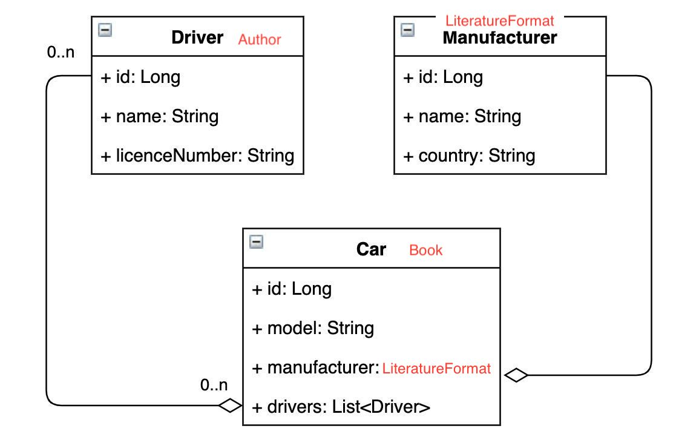
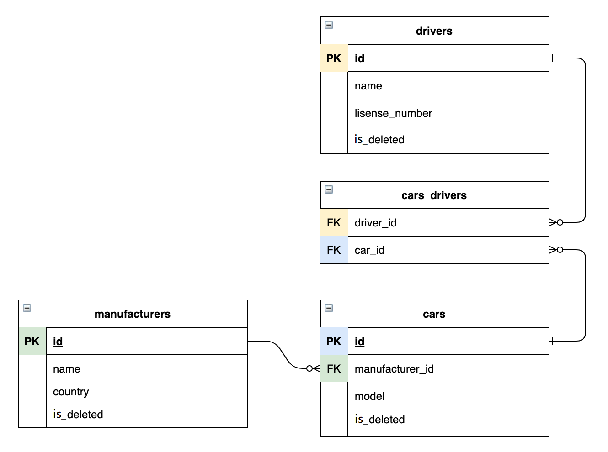

# HW 04
- Create class `Car`.
- Create `CarService` interface with implementation.

### CarService methods:
    - Car create(Car car);
    - Car get(Long id);
    - List<Car> getAll();
    - Car update(Car car);
    - boolean delete(Long id);
    - void addDriverToCar(Driver drivers, Car car);
    - void removeDriverFromCar(Driver drivers, Car car);
    - List<Car> getAllByDriver(Long driverId);

- Test your solution in the `main` method.
- Don't forget about a table's and columns' namings.
- These methods should be only on the service layer: 
```
    - void addDriverToCar(Driver drivers, Car car);
    - void removeDriverFromCar(Driver drivers, Car car);
```

__Before submitting solution make sure you checked it first with__ [checklist](https://mate-academy.github.io/jv-program-common-mistakes/java-JDBC/join/Joins_checklist.html)





